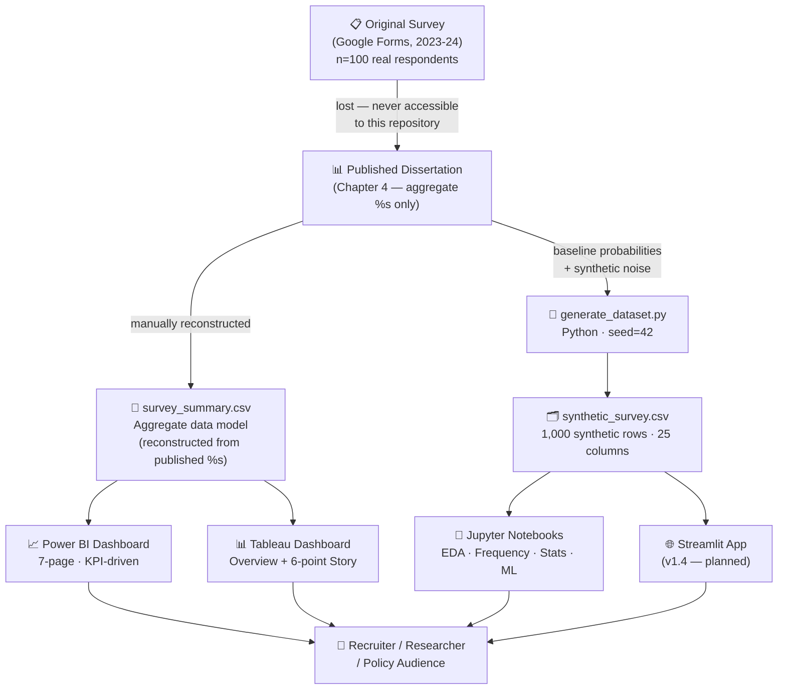

# Project Architecture

This document describes the structure, data flow, and design decisions of the repository.

---

## Overview

The project is organized as a **full-cycle social analytics pipeline** — from raw survey instrument through aggregate analysis to interactive BI dashboards — with a synthetic dataset layer added for reproducible tooling demonstrations.

There are two distinct data paths:

| Path | Source | Used for |
|---|---|---|
| **Aggregate path** | Published dissertation percentages (Chapter 4) | Power BI / Tableau dashboards, key findings |
| **Synthetic path** | `generate_dataset.py` (seed 42) | EDA notebooks, ML demos, Streamlit app |

The synthetic dataset is **never** presented as primary research evidence. It exists solely to make the analysis pipeline runnable end-to-end without original respondent data.

---

## Repository layout

```
gender-sensitization-study/
│
├── .github/                        # GitHub-specific configuration
│   └── ISSUE_TEMPLATE/
│
├── app/                            # (v1.4) Streamlit web application
│   └── main.py
│
├── dashboards/
│   ├── powerbi/                    # .pbix + theme JSON
│   ├── tableau/                    # .twbx + Story
│   └── screenshots/                # Static PNG exports (README previews)
│
├── data/
│   ├── processed/
│   │   ├── survey_summary.csv      # Aggregate findings (reconstructed from dissertation)
│   │   └── demographics_summary.csv
│   └── synthetic/
│       ├── synthetic_survey.csv    # 1,000-row simulated respondent dataset
│       └── generate_dataset.py     # Reproducible generation script (seed=42)
│
├── docs/
│   └── questionnaire.md            # Reconstructed survey instrument
│
├── notebooks/                      # (v1.1+) Jupyter analysis notebooks
│   ├── 01_eda.ipynb
│   ├── 02_frequency_analysis.ipynb
│   ├── 03_visualisations.ipynb
│   ├── 04_statistical_tests.ipynb  # (v1.2)
│   ├── 05_ml_classification.ipynb  # (v1.3)
│   └── 06_clustering.ipynb         # (v1.3)
│
├── report/
│   └── full-dissertation.pdf
│
├── visuals/
│   └── charts/                     # Exported chart images
│
├── CHANGELOG.md
├── CITATION.cff
├── CODE_OF_CONDUCT.md
├── CONTRIBUTING.md
├── DATA.md                         # Data availability statement
├── DATA_GENERATION.md              # Synthetic data methodology & disclaimer
├── LICENSE
├── PROJECT_ARCHITECTURE.md         # This file
├── PROJECT_SHOWCASE.md             # Recruiter-facing summary
├── README.md
├── ROADMAP.md
├── SECURITY.md
└── requirements.txt
```

---

## Data flow



---

## Key design decisions

### 1. Aggregate-only dashboard model
Because the original Google Form response sheet was permanently lost, dashboards are powered by `survey_summary.csv` — a reconstructed aggregate table derived solely from the percentages already published in Chapter 4. This avoids fabricating individual responses while still enabling a fully functional BI data model.

### 2. Forward-compatible star schema
The Power BI / Tableau data model is designed as a star schema so a future re-run (with real row-level data) can replace the aggregate source tables with a fact table and dimension tables, with zero dashboard redesign required.

### 3. Synthetic data as a separate layer
`synthetic_survey.csv` is stored under `data/synthetic/` (not `data/processed/`) to make the separation between simulated and reconstructed-aggregate data structurally explicit — not just a naming convention.

### 4. Reproducibility via seed
`generate_dataset.py` uses `random.seed(42)`, so re-running the script always produces an identical `synthetic_survey.csv`. The seed value and generation methodology are fully documented in `DATA_GENERATION.md`.

### 5. Ethics-first documentation
`DATA.md` and `DATA_GENERATION.md` are first-class repository files — not buried in a README footnote — because transparent data governance is a core project value, not an afterthought.

---

## Module responsibilities

| File / Directory | Responsibility |
|---|---|
| `data/processed/` | Ground truth for all dashboard numbers; sourced from published dissertation |
| `data/synthetic/` | Training/demo data for notebooks and app; clearly labelled as simulated |
| `dashboards/` | BI deliverables; each tool folder is self-contained |
| `notebooks/` | Reproducible analysis; each notebook is independently executable |
| `app/` | Interactive web layer; reads from `data/synthetic/` only |
| `docs/` | Supporting documentation; survey instrument and design specs |
| `report/` | Archival; the original academic write-up in PDF form |
