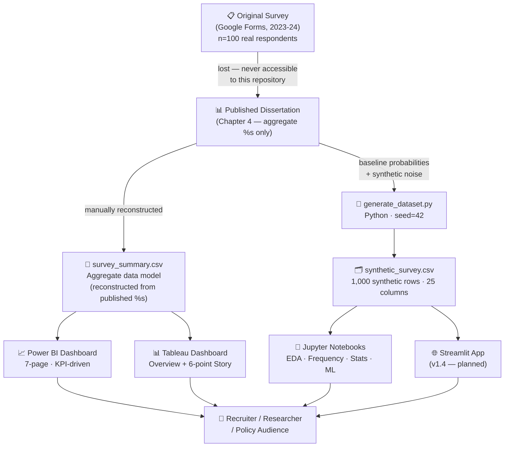

# Project Architecture

This document describes the structure, data flow, and design decisions of the repository.

---

## Overview

The project is organized as a **full-cycle social analytics pipeline** — from raw survey instrument through aggregate analysis to interactive BI dashboards — with a synthetic dataset layer added for reproducible tooling demonstrations.

There are two distinct data paths:

| Path | Source | Used for |
|---|---|---|
| **Aggregate path** | Published dissertation percentages (Chapter 4) | Power BI / Tableau dashboards, key findings |
| **Synthetic path** | `generate_dataset.py` (seed 42) | EDA notebooks, ML demos, Streamlit app |

The synthetic dataset is **never** presented as primary research evidence. It exists solely to make the analysis pipeline runnable end-to-end without original respondent data.

---

## Repository layout

```
gender-sensitization-study/
│
├── .github/                        # GitHub-specific configuration
│   └── ISSUE_TEMPLATE/
│
├── app/                            # (v1.4) Streamlit web application
│   └── main.py
│
├── dashboards/
│   ├── powerbi/                    # .pbix + theme JSON
│   ├── tableau/                    # .twbx + Story
│   └── screenshots/                # Static PNG exports (README previews)
│
├── data/
│   ├── processed/
│   │   ├── survey_summary.csv      # Aggregate findings (reconstructed from dissertation)
│   │   └── demographics_summary.csv
│   └── synthetic/
│       ├── synthetic_survey.csv    # 1,000-row simulated respondent dataset
│       └── generate_dataset.py     # Reproducible generation script (seed=42)
│
├── docs/
│   └── questionnaire.md            # Reconstructed survey instrument
│
├── notebooks/                      # (v1.1+) Jupyter analysis notebooks
│   ├── 01_eda.ipynb
│   ├── 02_frequency_analysis.ipynb
│   ├── 03_visualisations.ipynb
│   ├── 04_statistical_tests.ipynb  # (v1.2)
│   ├── 05_ml_classification.ipynb  # (v1.3)
│   └── 06_clustering.ipynb         # (v1.3)
│
├── report/
│   └── full-dissertation.pdf
│
├── visuals/
│   └── charts/                     # Exported chart images
│
├── CHANGELOG.md
├── CITATION.cff
├── CODE_OF_CONDUCT.md
├── CONTRIBUTING.md
├── DATA.md                         # Data availability statement
├── DATA_GENERATION.md              # Synthetic data methodology & disclaimer
├── LICENSE
├── PROJECT_ARCHITECTURE.md         # This file
├── PROJECT_SHOWCASE.md             # Recruiter-facing summary
├── README.md
├── ROADMAP.md
├── SECURITY.md
└── requirements.txt
```

---

## Data flow



---

## Key design decisions

### 1. Aggregate-only dashboard model
Because the original Google Form response sheet was permanently lost, dashboards are powered by `survey_summary.csv` — a reconstructed aggregate table derived solely from the percentages already published in Chapter 4. This avoids fabricating individual responses while still enabling a fully functional BI data model.

### 2. Forward-compatible star schema
The Power BI / Tableau data model is designed as a star schema so a future re-run (with real row-level data) can replace the aggregate source tables with a fact table and dimension tables, with zero dashboard redesign required.

### 3. Synthetic data as a separate layer
`synthetic_survey.csv` is stored under `data/synthetic/` (not `data/processed/`) to make the separation between simulated and reconstructed-aggregate data structurally explicit — not just a naming convention.

### 4. Reproducibility via seed
`generate_dataset.py` uses `random.seed(42)`, so re-running the script always produces an identical `synthetic_survey.csv`. The seed value and generation methodology are fully documented in `DATA_GENERATION.md`.

### 5. Ethics-first documentation
`DATA.md` and `DATA_GENERATION.md` are first-class repository files — not buried in a README footnote — because transparent data governance is a core project value, not an afterthought.

---

## Module responsibilities

| File / Directory | Responsibility |
|---|---|
| `data/processed/` | Ground truth for all dashboard numbers; sourced from published dissertation |
| `data/synthetic/` | Training/demo data for notebooks and app; clearly labelled as simulated |
| `dashboards/` | BI deliverables; each tool folder is self-contained |
| `notebooks/` | Reproducible analysis; each notebook is independently executable |
| `app/` | Interactive web layer; reads from `data/synthetic/` only |
| `docs/` | Supporting documentation; survey instrument and design specs |
| `report/` | Archival; the original academic write-up in PDF form |
# DATA_GENERATION.md

## ⚠️ This dataset is 100% synthetic

`synthetic_survey.csv` does **not** contain any real participant responses.
No individual-level data from the original dissertation, *"Perspectives on
Gender Sensitization: A Kanpur-based comprehensive study"* (Anshika Gupta,
Christ Church College, Kanpur, 2023–24), was ever available to this script —
that study only published **aggregate percentages** (e.g., "77% of
respondents had heard of the term Gender Sensitization") derived from its
own 100 real survey participants. Those original individual responses were
never accessed, reconstructed, or reproduced here in any form.

This synthetic dataset exists **purely for analytics, dashboarding, and
machine-learning demonstration purposes** — for example, practicing data
cleaning, building visualizations, or testing classification/clustering
pipelines on survey-shaped categorical data.

## What was generated

- **1000 synthetic respondents**, each with a randomly generated ID
  (`R0001`–`R1000`).
- **25 columns** covering demographics (age group, gender, education) and
  attitudinal questions spanning gender sensitization awareness, gender
  stereotypes, gender roles, gender equality, and gender-based violence —
  mirroring the *topics* covered in Chapter 4 of the dissertation.

## How values were generated

1. **Baseline probabilities** for each categorical response were set to
   approximately match the percentages reported in the dissertation (e.g.,
   "82% agreed it is okay for men to cry" → roughly 82% probability of
   `Agree` in the synthetic data, before added variation).
2. **Random sampling with noise**: each of the 1000 synthetic respondents'
   answers was drawn independently using Python's `random` module from
   these probability distributions, so the resulting dataset reproduces the
   published aggregates only *approximately* (typically within a few
   percentage points), exactly as you'd expect from natural sampling
   variation — not as an exact replica.
3. **Invented relationships between variables** were deliberately added so
   the dataset is useful for demonstrating correlation/regression/ML
   techniques. For example:
   - Respondents with higher education levels were given a slightly higher
     probability of reporting awareness of the term "Gender Sensitization."
   - Older respondents were given a slightly higher probability of having
     received formal gender-related training.
   - Respondents who had never heard the term, or never received training,
     were given a modestly higher probability of agreeing with traditional
     gender stereotypes.

   **These relationships are entirely fictional constructs introduced by
   the generation script.** The original dissertation reports only
   univariate percentages and does **not** claim, test, or demonstrate any
   such cross-variable relationships. Do not cite this dataset, or any
   pattern found within it, as evidence of real-world relationships between
   education, age, training, and attitudes.

## Files in this package

| File | Purpose |
|---|---|
| `generate_dataset.py` | The Python script that produces `synthetic_survey.csv` from scratch using only random sampling. Re-running it (with the fixed random seed `42`) reproduces the same dataset. |
| `synthetic_survey.csv` | The 1000-row synthetic dataset itself. |
| `DATA_GENERATION.md` | This document. |

## Appropriate uses

- Practicing pandas/SQL data wrangling
- Building example dashboards or charts
- Testing ML classification/clustering code on realistic categorical data
- Teaching demonstrations about survey data structure

## Inappropriate uses

- Citing this file as real survey evidence in academic papers, news
  articles, or policy briefs
- Treating any statistic, correlation, or trend in this file as a finding
  about actual attitudes in Kanpur or elsewhere
- Substituting this file for the original dissertation's findings

If you need the **real, published** aggregate findings, refer directly to
Chapter 4 of the original dissertation.
